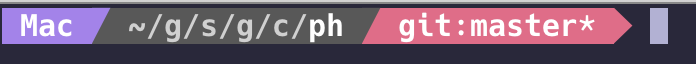
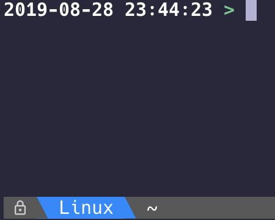

# Prompt Helper


## Background

I am very not good at shell script. Early this year, I moved my daily development shell from zsh to fish. It took me times to move my prompt setting. So why not do it on Go. It also a good small project to learn a new language.

It looks pretty good now and works for tmux and shell.

git status clean:<br>


git status dirty:<br>


tmux:<br>


## Install

1. Install [nerd fonts](https://github.com/ryanoasis/nerd-fonts), I am using `Hack Nerf fonts`, not all fonts works good on my environment.
2. run `./install.sh`. Please ensure ~/go/bin in PATH.
3. (Optional) You can custom your prompt color scheme. Copy or link `ph.example.conf` to ~/.ph.

### Setup for fish

Put `ph` in function `fish_prompt`, `ph shortpath` maybe useful for window title.

```fish
function fish_prompt
  set -l last_status $status
  $HOME/bin/ph prompt $last_status
end

function fish_title
  # short pwd
  set p ($HOME/bin/ph shortpath)

  # current running and OS
  if [ $_ = 'fish' ]
    if [ -n "$TMUX" ]
      printf $p
      return
    end
    printf '@%s:   %s' $OS_NAME $p
  else
    if [ -n "$TMUX" ]
      printf '%s %s' $OS_NAME $_ $p
      return
    end
    printf '@%s:   %s %s' $OS_NAME $_ $p
  end
end
```

### Setup for tmux

I put prompt info on the left and the window list on the right of status bar.

```
# tmux.conf
# Show nothing on status left
set -g status-left ''
set -g status-left-length 80

# Show nothing on status right
set -g status-right ''

set -g status-justify right
set -g window-status-current-bg colour28
set -g window-status-current-format ' #[fg=colour15]#I.#W#F '
set -g window-status-current-attr bold
set -g window-status-format ' #[fg=colour15]#I.#W '
```

Set status bar when receive fish_prompt event.

```fish
function set_status -e fish_prompt
  if [ ! -n "$TMUX" ]
    return
  end

  set -l tmuxstatus ($HOME/bin/ph tmux)
  tmux set -g status-left "$tmuxstatus" 1
end
```

## Try it now

```
/path/to/ph prompt 1
/path/to/ph tmux 1
/path/to/ph shortpath
```

## Configure

ph has default config. But still allow you to customize. You only need to add the fill you want to change.

```yaml
vcs:
 # want to make ph faster, tell ph to skip git.
 git_skip:
  - /not/path/for/code

# Path shortern, home already included
path_shortern:
 ^/long/path: short

# Change theme
theme:
 prompt: simpleass

scheme:
 # only change color of os field for simpleass theme
 simpleass:
  os:
   fg: 15
```

## Integration

You can use ph as library and buid your own ph. You can build your theme and vcs support and then register it like `cmd/cmd.go`.

## License

Apache 2.0
